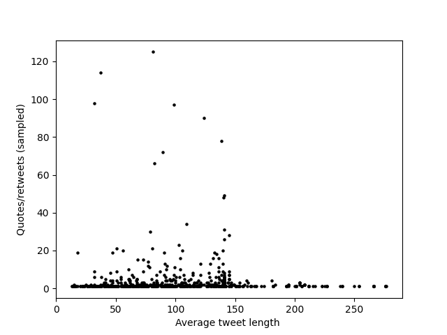

## An Analysis of Tweets Surrounding The 22 January 2022 Protests on MACC 

## Introduction

On 22 January 2022, hundreds of protesters made up of political parties and civil societies took to streets of Kuala Lumpur, Malaysia to demand for the resignation of MACC Chief, Tan Sri Dato’ Sri Haji Azam bin Baki amidst the corruption scandals plaguing his tenure. As the action happened on the streets, in this research project, we will look for the conversations happening surrounding the events of the protest on the twitter digital space with the outcome of gaining insights on political conversations in Malaysia.

## Data Collection

About 90k tweets were pulled with twitter API's stream tweets feature with about 5% sampled for the dataset. The code for streaming the tweets can be found in the project repo: [here](https://github.com/tehcanai/Protest-tweets-sat-22/blob/6c17d6b31cbeb5df3cc787280fcd01c0d60a969d/stream_tweets.py)

### Stream Tweet Ruleset

The ruleset for the tweets to be pulled consists of words that can be found such usually in tweets concerning politics. Thus, we filtered the stream based on five tags we created based on issues which are Malay, Royals, Political Parties, Government, and People in an attempt to pull the tweets that are actually concerning politics. There are no tags related to protests, corruption, or the MACC as we intend to check if these issues will be placed in similar contexts with the created tags by us.

Ruleset:
```markdown
"value": "melayu OR melayu islam OR ketuanan melayu OR bangsa melayu",
"tag": "melayu"

"value": "sultan melayu OR agong OR raja melayu",
"tag": "sultan"
 
"value": "umno OR pakatan harapan OR DAP malaysia OR Barisan Nasional",
"tag": "parti politik"

"value": "Kerajaan OR gov malaysia OR malaysian government OR gomen OR kjaan",
"tag": "Kjaan"
 
"value": "rakyat OR marhaen OR negara",
"tag": "negara"
 ```
## Analysis and Results

### Popularity vs Tweet Length

We attempted to look on what type of tweets that were popular to be retweeted and shared by twitter users. The graph is then generated with this [code](https://github.com/tehcanai/Protest-tweets-sat-22/blob/f2da65412b4fd8fd0b8b5892bb25fea063fdaf70/twitter_graph.py) as below :



From the graph, the best performing tweets were less than 150 words and most tweets did not reach more than 20 sampled retweets/quotes. We can probably hypothesize that the most popular tweets are short in nature for political tweets. Whether this affects all tweets in general, we do not know.

### Adjacent Issues in Tweets

For this one, we attempted to identify adjacent political issues. Adjacent political issues are identified by searching if twitter users tweeted certain keywords in the same tweet which we assume its because they are referring it in the same context. With this, we can possibly identify issues that while not obviously correlated, is put in the same context by people. The code to search for the keywords is [here](https://github.com/tehcanai/Protest-tweets-sat-22/blob/f2da65412b4fd8fd0b8b5892bb25fea063fdaf70/twitter_graph.py)

Keywords
```markdown
target_words = ["banjir", "kerajaan", "protes", "Azam Baki", "melayu"
                "pembangkang", "korup", "corrupt", "raja", "rakyat"]
```

Results of Search
```markdown
['Azam Baki', 'rakyat'] : 11
['banjir', 'Azam Baki', 'rakyat'] : 43
['kerajaan', 'raja'] : 109
['banjir', 'protes', 'Azam Baki', 'rakyat'] : 2
['banjir', 'rakyat'] : 36
['banjir', 'Azam Baki'] : 64
['korup', 'raja'] : 60
['kerajaan', 'protes', 'raja'] : 6
['korup', 'corrupt'] : 2
['protes', 'rakyat'] : 3
['korup', 'rakyat'] : 3
['banjir', 'kerajaan', 'raja'] : 6
['kerajaan', 'raja', 'rakyat'] : 2
['banjir', 'raja'] : 3
['raja', 'rakyat'] : 4
['protes', 'corrupt', 'rakyat'] : 2
['kerajaan', 'Azam Baki', 'raja'] : 2
['Azam Baki', 'corrupt'] : 2
['banjir', 'kerajaan', 'raja', 'rakyat'] : 2
```

There are some interesting grouping of keywords in tweets. The most frequent is "kerajaan" and "raja" with 109 hits. However, that is not a surprising pairing. A surprising correlation is "banjir" and "Azam Baki" with 64 hits. Twitter users are correlating flood situations with the current predicament of Azam Baki. This correlation is also supported by the grouping, "banjir", "Azam Baki", and "rakyat". Another interesting one is "korup" and "raja" with 60 hits. It seems that twitter users are correlating corruption with the royal institution. There are also no groupings with "melayu". None at all. This could mean that the MACC scandal is not considered a racial issue.

## Limitations

This research project has several limitations in its results. Firstly, the ruleset could be more expansive to capture a much more variety of tweets that are politically inclined. However, we are limited by twitter's API limitation on stream tweets feature. Secondly, the keywords searched for finding adjacent issues could be added more into it to create a better picture of political issues discussed in those tweets.  However, I don't have time. Lastly, there other better methods to analyze the tweets that yield better insight and results. However, I am severely limited by a lack of experience and expertise.

## Technologies

[Twitter Developer API](https://developer.twitter.com/en)

Python - [matplotlib](https://matplotlib.org/)
